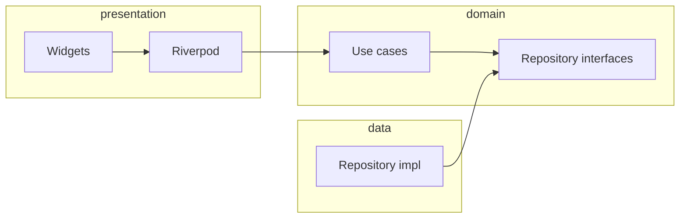

# Taxi Rider (Flutter)

Passenger-side rideshare demo: Firebase Auth + Realtime Database, Google Maps,
Geofire-style nearby drivers, and a Clean Architecture-style layout suitable for
a portfolio review.

> Dart package name: `taxi_rider_app` (`pubspec.yaml`). Repository folder name
> may differ on disk.

---

## Architecture

Layers and dependency direction:

- **`lib/app/`** — `MaterialApp.router`, GoRouter, theme.
- **`lib/core/`** — `AppConfig` (dart-define), `Result` / `Failure`, logging,
  Firebase `DatabaseReference` providers.
- **`lib/features/<feature>/`** — vertical slices:
  - **`domain/`** — entities, repository contracts, use cases.
  - **`data/`** — Firebase / HTTP implementations.
  - **`presentation/`** — Riverpod providers, pages.



Main map and ride flow live under
[`lib/features/home_map/presentation/main_map_page.dart`](lib/features/home_map/presentation/main_map_page.dart).

---

## Secrets and configuration

**Do not commit API keys or FCM secrets.** Use compile-time defines (recommended):

```bash
flutter run \
  --dart-define=MAPS_API_KEY=YOUR_GOOGLE_MAPS_KEY \
  --dart-define=FCM_AUTH_HEADER=key=YOUR_SERVER_KEY \
  --dart-define=PLACES_LANGUAGE=ro
```

- **`MAPS_API_KEY`** — Web service key used for Geocoding, Directions, Places
  (enable the corresponding APIs in Google Cloud).
- **`FCM_AUTH_HEADER`** — Value for the HTTP `Authorization` header when calling
  the legacy FCM endpoint (prefer migrating to HTTP v1 with OAuth2 in production).
- **`PLACES_LANGUAGE`** — Autocomplete language (default `ro`).

See [`.env.example`](.env.example) for a template and [SECURITY.md](SECURITY.md)
for rotation guidance if keys were ever exposed.

Native Maps SDK keys are loaded locally (not committed):

- **Android**: add `MAPS_API_KEY=...` to `android/local.properties`
  (already gitignored).
- **iOS**: copy `ios/Flutter/Secret.xcconfig.example` to
  `ios/Flutter/Secret.xcconfig` and set `MAPS_API_KEY=...`.

---

## Prerequisites

- Flutter SDK compatible with `sdk: '>=3.5.0 <4.0.0'` in `pubspec.yaml`.
- Firebase project with **Authentication (email/password)** and **Realtime
  Database**, plus `google-services.json` / `GoogleService-Info.plist` per
  [FlutterFire setup](https://firebase.google.com/docs/flutter/setup).
- Maps SDK keys on Android/iOS **and** the web API key above for REST calls.

---

## Run

```bash
flutter pub get
flutter run --dart-define=MAPS_API_KEY=... --dart-define=FCM_AUTH_HEADER=...
```

---

## Test and CI

```bash
flutter test
flutter analyze --no-fatal-infos
```

GitHub Actions: [`.github/workflows/flutter.yml`](.github/workflows/flutter.yml).

---

## Tech stack

| Area | Choice |
|------|--------|
| UI | Flutter (Material 3) |
| Navigation | go_router |
| State | flutter_riverpod (`StateNotifier` for session/trip/map helpers) |
| Backend | Firebase Auth, Realtime Database |
| Maps / geo | google_maps_flutter, geolocator, flutter_geofire, flutter_polyline_points |
| HTTP | `http` for Google REST APIs behind repository classes |

---

## License

Not published to pub.dev (`publish_to: 'none'`). Add a `LICENSE` file if you
redistribute the repo.
